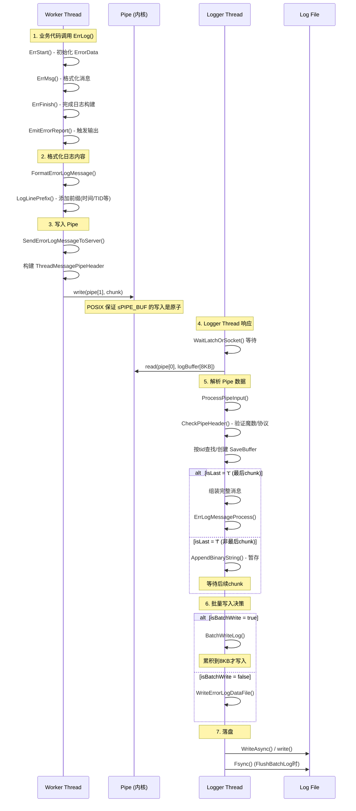
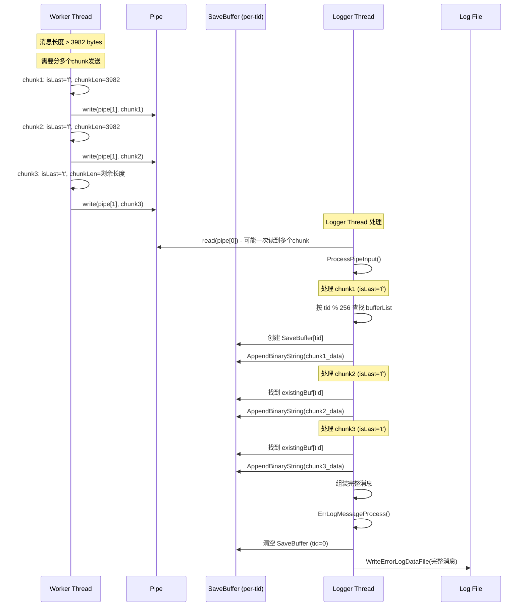

# Logger Thread 日志系统详解

## 一、架构概览

### 1.1 整体架构图

```
┌─────────────────────────────────────────────────────────────────────────────────────┐
│                              dstore 进程                                              │
├─────────────────────────────────────────────────────────────────────────────────────┤
│                                                                                       │
│  ┌─────────────────┐    ┌─────────────────┐    ┌─────────────────┐                   │
│  │   Worker 线程1   │    │   Worker 线程2   │    │   Worker 线程N   │                   │
│  │                 │    │                 │    │                 │                   │
│  │  ErrLog(...)    │    │  ErrLog(...)    │    │  ErrLog(...)    │                   │
│  │       │         │    │       │         │    │       │         │                   │
│  │       ▼         │    │       ▼         │    │       ▼         │                   │
│  │ SendErrorLog    │    │ SendErrorLog    │    │ SendErrorLog    │                   │
│  │ MessageToServer │    │ MessageToServer │    │ MessageToServer │                   │
│  │       │         │    │       │         │    │       │         │                   │
│  │       │ write() │    │       │ write() │    │       │ write() │                   │
│  └───────┼─────────┘    └───────┼─────────┘    └───────┼─────────┘                   │
│          │                      │                      │                             │
│          ▼                      ▼                      ▼                             │
│  ┌─────────────────────────────────────────────────────────────────────┐             │
│  │                          Pipe (内核缓冲区)                            │             │
│  │  ┌─────────────────────────────────────────────────────────────┐    │             │
│  │  │  messagePipe[0] (读端) ←─────── messagePipe[1] (写端)        │    │             │
│  │  │       ↑                          ↑↑↑↑↑↑↑↑↑↑↑↑↑↑↑↑↑↑↑↑↑↑↑↑↑   │    │             │
│  │  │       │                          多线程并发写入               │    │             │
│  │  │  4KB chunks (带Header)           POSIX pipe原子写入保证       │    │             │
│  │  └─────────────────────────────────────────────────────────────┘    │             │
│  └─────────────────────────────────────────────────────────────────────┘             │
│                              │                                                        │
│                              │ read()                                                 │
│                              ▼                                                        │
│  ┌─────────────────────────────────────────────────────────────────────┐             │
│  │                        Logger Thread (专用线程)                       │             │
│  │  ┌───────────────────────────────────────────────────────────────┐  │             │
│  │  │                    MainWorkerLoop()                            │  │             │
│  │  │                                                                │  │             │
│  │  │  for (;;) {                                                    │  │             │
│  │  │      WaitLatchOrSocket(pipe[0])  ←── 等待数据/超时             │  │             │
│  │  │      read(pipe[0], logBuffer[8KB])                             │  │             │
│  │  │      ProcessPipeInput() ←── 解析chunks                         │  │             │
│  │  │      ErrLogMessageProcess()                                    │  │             │
│  │  │      BatchWriteLog() / WriteErrorLogDataFile()                 │  │             │
│  │  │  }                                                             │  │             │
│  │  └───────────────────────────────────────────────────────────────┘  │             │
│  │                              │                                      │             │
│  │                              │ WriteAsync()                         │             │
│  │                              ▼                                      │             │
│  │  ┌───────────────────────────────────────────────────────────────┐  │             │
│  │  │  msgBatchData (8KB批量缓冲区)                                  │  │             │
│  │  │  LOG_BATCH_BUF_SIZE = 8192                                     │  │             │
│  │  └───────────────────────────────────────────────────────────────┘  │             │
│  └─────────────────────────────────────────────────────────────────────┘             │
│                              │                                                        │
│                              │ write() 系统调用                                       │
│                              ▼                                                        │
│  ┌─────────────────────────────────────────────────────────────────────┐             │
│  │                        Log File (磁盘)                               │             │
│  │  ┌─────────────────────────────────────────────────────────────┐    │             │
│  │  │  error_log/gaussdb-current.log                               │    │             │
│  │  │  格式: Timestamp + TID + File:Line + Level + Message         │    │             │
│  │  └─────────────────────────────────────────────────────────────┐    │             │
│  └─────────────────────────────────────────────────────────────────────┘             │
│                                                                                       │
└─────────────────────────────────────────────────────────────────────────────────────┘
```

### 1.2 核心数据结构关系

```
┌──────────────────────────────────────────────────────────────────────────────┐
│                         ThreadMessagePipeHeader                               │
│  (每个chunk的头部，固定大小)                                                   │
├──────────────────────────────────────────────────────────────────────────────┤
│  Offset   Field          Type         Size    Description                    │
│  ───────  ──────────     ─────────    ─────   ─────────────────────────────  │
│  0        nuls[2]        char[2]      2       固定 "\0\0"，用于检测协议边界    │
│  2        chunkLen       uint16_t     2       本chunk数据长度 (不含header)     │
│  4        msgType        uint8_t      1       消息类型 (ERROR/PROFILE/SQL等)  │
│  5        isLast         char         1       't'/'T'=最后chunk,'f'/'F'=非最后│
│  6        (padding)      -            2       对齐填充                        │
│  8        tid            pthread_t    8       发送线程ID，用于消息重组         │
│  16       magic          uint64_t     8       魔数 0x123456789ABCDEF0         │
│  24       msgContext     LogIdentifier ~90    日志元信息                       │
│  ~114     data[]         char[]       变长    实际日志数据                     │
├──────────────────────────────────────────────────────────────────────────────┤
│  THREAD_MESSAGE_PIPE_HEADER_LEN = offsetof(ThreadMessagePipeHeader, data)    │
│                          ≈ 114 bytes (取决于 LogIdentifier 大小)              │
│  THREAD_MESSAGE_PIPE_MAX_PAYLOAD = 4096 - HEADER_LEN ≈ 3982 bytes            │
│  THREAD_MESSAGE_PIPE_CHUNK_SIZE = 4096 bytes                                 │
└──────────────────────────────────────────────────────────────────────────────┘

┌──────────────────────────────────────────────────────────────────────────────┐
│                            LogIdentifier                                      │
│  (日志元信息，用于日志折叠、流控等)                                            │
├──────────────────────────────────────────────────────────────────────────────┤
│  Field          Type         Size    Description                              │
│  ──────────     ─────────    ─────   ─────────────────────────────────────   │
│  threadId       uint64_t     8       线程唯一标识                              │
│  lineNum        int          4       源码行号                                  │
│  logLevel       int          4       日志级别 (DEBUG/LOG/ERROR等)             │
│  timeSecond     time_t       8       时间戳                                    │
│  fileName       char[60]     60      源文件名                                  │
│  ─────────────────────────────────────────────────────────────────────────── │
│  Total: ~84 bytes                                                            │
└──────────────────────────────────────────────────────────────────────────────┘
```

---

## 二、UML 时序图

### 2.1 单次日志输出完整时序



### 2.2 大消息分 Chunk 处理时序



---

## 三、关键代码路径

| 步骤 | 函数 | 文件位置 | 说明 |
|------|------|----------|------|
| 1. 启动 Logger Thread | `StartLogger` → `StartLoggerInternal` | syslogger.c:4480 | 创建线程和 pipe |
| 2. 创建 pipe | `pipe(messagePipe)` | syslogger.c:4393 | messagePipe[0]读端, [1]写端 |
| 3. 用户调用日志 | `ErrLog` (宏) | err_log.h:187 | ErrStart → ErrMsg → ErrFinish |
| 4. 格式化消息 | `FormatErrorLogMessage` | err_log.c:1395 | 生成带前缀的日志字符串 |
| 5. 写入 pipe | `SendErrorLogMessageToServer` | err_log.c:1470 | 构建chunk header并write() |
| 6. 获取写端 fd | `GetMessagePipe()` | syslogger.c:3483 | 返回 pipe[1] |
| 7. Logger 主循环 | `MainWorkerLoop` | syslogger.c:4094 | 等待+读取+处理 |
| 8. 等待数据 | `WaitLatchOrSocket` | syslogger.c:839 | poll() 等待 pipe[0] 可读 |
| 9. 读取 pipe | `read(pipe[0], logBuffer)` | syslogger.c:4127 | 最多读 8KB |
| 10. 解析 pipe | `ProcessPipeInput` | syslogger.c:3974 | 解析 chunks |
| 11. 验证 header | `CheckPipeHeader` | syslogger.c:3834 | 检查魔数、协议边界 |
| 12. 处理非最后chunk | `ProcessLastChunkOfMessage` | syslogger.c:3937 | 暂存到 SaveBuffer |
| 13. 处理完整消息 | `ErrLogMessageProcess` | syslogger.c:3745 | 折叠判断+流控+写入 |
| 14. 批量写入 | `BatchWriteLog` | syslogger.c:2266 | 累积到 8KB |
| 15. 刷新批量 | `FlushBatchLog` | syslogger.c:2242 | 写入+fsync |
| 16. 落盘 | `WriteLocalLogDataFile` → `WriteAsync` | syslogger.c:2165 | write() 系统调用 |

---

## 四、MainWorkerLoop Pipe 解析详解

### 4.1 数据流解析流程

```c
// MainWorkerLoop 核心逻辑 (syslogger.c:4094)
for (;;) {
    // 1. 等待数据到达
    rc = WaitLatchOrSocket(&latch, WL_SOCKET_READABLE | WL_TIMEOUT, pipe[0], timeout);
    
    if (rc & WL_SOCKET_READABLE) {
        // 2. 读取 pipe 数据到 logBuffer (8KB)
        bytesRead = read(pipe[0], logBuffer + bytesInLogbuffer, sizeof(logBuffer) - bytesInLogbuffer);
        
        if (bytesRead > 0) {
            bytesInLogbuffer += bytesRead;  // 累积未处理数据
            
            // 3. 解析 logBuffer 中的 chunks
            ProcessPipeInput(logBuffer, &bytesInLogbuffer, ...);
        }
    }
}
```

### 4.2 ProcessPipeInput 解析逻辑

```
┌─────────────────────────────────────────────────────────────────────────────┐
│                      ProcessPipeInput 解析流程                               │
├─────────────────────────────────────────────────────────────────────────────┤
│                                                                              │
│  logBuffer[8KB] 内容示例:                                                    │
│  ┌────────────────┬────────────────┬────────────────┬──────────────┐       │
│  │   Chunk 1      │   Chunk 2      │   Chunk 3      │   未读数据   │       │
│  │ (完整消息)     │ (非最后chunk)  │ (最后chunk)    │              │       │
│  │ Header+Data    │ Header+Data    │ Header+Data    │              │       │
│  └────────────────┴────────────────┴────────────────┴──────────────┘       │
│       ↑              ↑              ↑              ↑                        │
│       cursor         cursor         cursor         剩余不完整               │
│                                                                              │
│  while (bytesCount >= sizeof(ThreadMessagePipeHeader)) {                    │
│      // 步骤1: 复制 header                                                   │
│      memcpy_s(&p, sizeof(ThreadMessagePipeHeader), cursor, ...);            │
│                                                                              │
│      // 步骤2: 验证 header                                                   │
│      if (CheckPipeHeader(p)) {                                               │
│          chunkLen = HEADER_LEN + p.chunkLen;                                 │
│                                                                              │
│          // 步骤3: 检查是否有完整 chunk                                       │
│          if (bytesCount < chunkLen) break;  // 数据不完整,等待下次read       │
│                                                                              │
│          // 步骤4: 按 tid 查找 SaveBuffer                                     │
│          bufferList = bufferLists[tid % 256];                                │
│          遍历查找 existingBuf[tid] 或空闲 freeBuf                            │
│                                                                              │
│          // 步骤5: 根据 isLast 处理                                           │
│          if (isLast == 'f' || isLast == 'F') {                               │
│              // 非最后chunk: 暂存                                             │
│              ProcessLastChunkOfMessage(existingBuf, freeBuf, ...);           │
│          } else {                                                            │
│              // 最后chunk: 组装并输出                                         │
│              if (existingBuf != NULL) {                                      │
│                  AppendBinaryString(existingBuf, chunk_data);                │
│                  WriteErrorLog(完整消息);                                     │
│              } else {                                                        │
│                  WriteErrorLog(单chunk消息);                                  │
│              }                                                               │
│          }                                                                   │
│                                                                              │
│          // 步骤6: 移动 cursor                                                │
│          cursor += chunkLen;                                                 │
│          bytesCount -= chunkLen;                                             │
│      } else {                                                                │
│          // 协议异常: 跳过直到找到下一个 '\0'                                  │
│          ...                                                                 │
│      }                                                                       │
│  }                                                                           │
│                                                                              │
│  // 步骤7: 左移剩余数据                                                       │
│  if (bytesCount > 0) memmove_s(logBuffer, cursor, bytesCount);              │
│                                                                              │
└─────────────────────────────────────────────────────────────────────────────┘
```

### 4.3 CheckPipeHeader 验证内容

```c
// syslogger.c:3834
static bool CheckPipeHeader(ThreadMessagePipeHeader p) {
    if (p.nuls[0] == '\0' &&               // 前两个字节必须是 \0\0
        p.nuls[1] == '\0' &&
        p.chunkLen > 0 &&                  // 数据长度 > 0
        p.chunkLen <= THREAD_MESSAGE_PIPE_MAX_PAYLOAD &&  // ≤3982
        p.tid != 0 &&                      // tid 有效
        (p.isLast == 't' || p.isLast == 'T' || 
         p.isLast == 'f' || p.isLast == 'F') &&  // isLast 有效
        p.msgType <= CSV_LOG_MESSAGE_TYPE &&  // 消息类型有效
        p.magic == PIPE_HEADER_MAGICNUM)      // 魔数正确
        return true;
    return false;
}
```

### 4.4 SaveBuffer 消息重组机制

```
┌─────────────────────────────────────────────────────────────────────────────┐
│                      bufferLists 消息重组机制                                │
├─────────────────────────────────────────────────────────────────────────────┤
│                                                                              │
│  bufferLists[256]:  按 tid 哈希的消息重组缓冲区                              │
│                                                                              │
│  ┌─────────────────────────────────────────────────────────────────────┐    │
│  │  bufferLists[tid % 256] → DListHead                                  │    │
│  │                                                                       │    │
│  │  DList:                                                               │    │
│  │  ┌──────────┐    ┌──────────┐    ┌──────────┐    ┌──────────┐       │    │
│  │  │SaveBuf   │───→│SaveBuf   │───→│SaveBuf   │───→│SaveBuf   │       │    │
│  │  │tid=123   │    │tid=456   │    │tid=789   │    │tid=0     │       │    │
│  │  │data=...  │    │data=...  │    │data=...  │    │(空闲)    │       │    │
│  │  └──────────┘    └──────────┘    └──────────┘    └──────────┘       │    │
│  │                                                                       │    │
│  │  SaveBuffer结构:                                                      │    │
│  │  struct SaveBuffer {                                                  │    │
│  │      pthread_t tid;      // 发送线程ID                                │    │
│  │      StringInfoData data; // 累积的数据                               │    │
│  │  };                                                                   │    │
│  │                                                                       │    │
│  └─────────────────────────────────────────────────────────────────────┘    │
│                                                                              │
│  重组流程:                                                                   │
│  1. 收到 chunk (isLast='f'): 按 tid 查找/创建 SaveBuffer                     │
│  2. AppendBinaryString() 将 chunk.data追加到 SaveBuffer.data                 │
│  3. 收到 chunk (isLast='t'): 取出完整消息,标记 SaveBuffer.tid=0              │
│                                                                              │
└─────────────────────────────────────────────────────────────────────────────┘
```

---

## 五、日志格式详解

### 5.1 Pipe Chunk 格式 (固定)

```
┌────────────────────────────────────────────────────────────────────────────┐
│                    ThreadMessagePipeChunk (4KB固定大小)                     │
├────────────────────────────────────────────────────────────────────────────┤
│                                                                             │
│  ┌───────────────────────────────────────────────────────────────────────┐ │
│  │ ThreadMessagePipeHeader                                               │ │
│  ├───────────────────────────────────────────────────────────────────────┤ │
│  │ [0-1]    nuls[2]        = "\0\0"                                      │ │
│  │ [2-3]    chunkLen       = 本chunk数据长度                              │ │
│  │ [4]      msgType        = 0(ERROR)/1(PROFILE)/2(SQL)/3(ASP)/4(CSV)    │ │
│  │ [5]      isLast         = 't'/'T'(最后) 或 'f'/'F'(非最后)            │ │
│  │ [6-7]    (padding)      = 对齐                                        │ │
│  │ [8-15]   tid            = pthread_t (发送线程)                        │ │
│  │ [16-23]  magic          = 0x123456789ABCDEF0                          │ │
│  │ [24-~]  msgContext      = LogIdentifier                               │ │
│  └───────────────────────────────────────────────────────────────────────┘ │
│  ┌───────────────────────────────────────────────────────────────────────┐ │
│  │ data[]                                                                │ │
│  │  - 最大长度: THREAD_MESSAGE_PIPE_MAX_PAYLOAD ≈ 3982 bytes            │ │
│  │  - 内容: 已格式化的日志字符串                                          │ │
│  └───────────────────────────────────────────────────────────────────────┘ │
│  ┌───────────────────────────────────────────────────────────────────────┐ │
│  │ filler[] (padding到4KB)                                               │ │
│  └───────────────────────────────────────────────────────────────────────┘ │
│                                                                             │
│  总大小: THREAD_MESSAGE_PIPE_CHUNK_SIZE = 4096 bytes                       │
│                                                                             │
└────────────────────────────────────────────────────────────────────────────┘
```

### 5.2 最终日志文件格式 (可配置)

```c
// 默认前缀配置 (err_log.h:137)
#define ERROR_LOG_DEFAULT_PREFIX \
    (LOG_LINE_PREFIX_TIMESTAMP | LOG_LINE_PREFIX_SEVERITY | \
     LOG_LINE_PREFIX_RUNNING_CONTEXT_TID | \
     LOG_LINE_PREFIX_COMPILATION_CONTEXT_FILE_NAME | \
     LOG_LINE_PREFIX_COMPILATION_CONTEXT_LINENO)
```

**示例输出:**
```
2026-04-19 10:30:45.123 CST [12345] syslog/syslogger.c:4094 WARNING:  example warning message
2026-04-19 10:30:46.456 CST [12345] buffer/bufmgr.c:123 ERROR:  buffer allocation failed
CAUSE:  insufficient memory
ACTION:  check memory configuration
CONTEXT:  during page read operation
LOCATION:  BufferAlloc, bufmgr.c:123
```

### 5.3 LogLinePrefix 格式符

| 格式符 | 含义 | 示例 |
|--------|------|------|
| `%m` | 高精度时间戳 | 2026-04-19 10:30:45.123 CST |
| `%t` | 秒级时间戳 | 2026-04-19 10:30:45 CST |
| `%p` | 线程ID | 12345 |
| `%l` | 日志行号 | 1, 2, 3... |
| `%a` | 应用名 | myapp |
| `%u` | 用户名 | admin |
| `%d` | 数据库名 | mydb |
| `%r` | 远程主机+端口 | 192.168.1.1(5432) |
| `%h` | 远程主机 | 192.168.1.1 |
| `%c` | 会话ID | 123456.1 |
| `%x` | 事务ID | 12345 |
| `%e` | SQLSTATE | 42000 |
| `%S` | 全局会话ID | 1[2:3#4] |
| `%T` | TraceID | trace_abc123 |
| `%%` | 百分号 | % |

---

## 六、关键常量定义

| 常量 | 值 | 说明 |
|------|-----|------|
| `THREAD_MESSAGE_PIPE_CHUNK_SIZE` | 4096 | Pipe chunk 固定大小 |
| `THREAD_MESSAGE_PIPE_HEADER_LEN` | ~114 | Header 部分大小 |
| `THREAD_MESSAGE_PIPE_MAX_PAYLOAD` | ~3982 | 最大 payload |
| `READ_BUF_SIZE` | 8192 | Logger Thread 读缓冲区 |
| `LOG_BATCH_BUF_SIZE` | 8192 | 批量写入缓冲区 |
| `BUFFER_LISTS_NUMBER` | 256 | SaveBuffer 哈希桶数 |
| `PIPE_HEADER_MAGICNUM` | 0x123456789ABCDEF0 | 协议魔数 |

---

## 七、设计要点总结

### 7.1 为什么用 Pipe 而不是锁+队列？

1. **原子写入保证**: POSIX 保证 ≤PIPE_BUF (通常4KB) 的写入是原子操作
2. **内核缓冲**: Pipe 使用内核缓冲区，避免用户态锁竞争
3. **自然阻塞**: Pipe 写满时自然阻塞，提供背压机制
4. **简单高效**: 单一 write() 调用，无需额外同步原语

### 7.2 为什么 chunk 大小是 4KB？

1. **匹配 PIPE_BUF**: 确保原子写入
2. **对齐页大小**: 内存操作效率高
3. **折中设计**: 既不大到浪费，也不小到频繁写入

### 7.3 大消息如何处理？

当消息超过 ~3982 bytes 时：
1. 分成多个 chunk，每个 chunk 的 isLast='f'
2. 最后一个 chunk 的 isLast='t'
3. Logger Thread 按 tid 组装完整消息后处理

### 7.4 为什么用 SaveBuffer 按 tid 存储？

1. **避免消息交错**: 不同线程的消息独立存储
2. **简化重组**: 直接按 tid 哈希查找
3. **内存效率**: 256个桶位，足够并发场景

---

## 八、相关文件清单

| 文件 | 路径 | 说明 |
|------|------|------|
| err_log.h | utils/interface/syslog/err_log.h | 公共接口定义 |
| err_log_internal.h | utils/include/syslog/err_log_internal.h | 内部数据结构 |
| err_log_fold.h | utils/include/syslog/err_log_fold.h | 日志折叠结构 |
| syslogger.c | utils/src/syslog/syslogger.c | Logger Thread 实现 |
| err_log.c | utils/src/syslog/err_log.c | 日志格式化和写入 |

---

## 九、磁盘故障场景分析

### 9.1 Linux I/O 栈分层结构

理解磁盘冻结场景，需要先理解 Linux I/O 栈的分层：

```
┌─────────────────────────────────────────────────────────────────────────────────┐
│                    Linux I/O 栈分层结构                                          │
├─────────────────────────────────────────────────────────────────────────────────┤
│                                                                                  │
│  用户空间                                                                        │
│  ─────────────────────────────────────────────────────────────────────────────  │
│  │  write() / aio_write() / io_submit()                                         │
│  │       │                                                                      │
│  │       │ syscall                                                              │
│  │       ▼                                                                      │
│  ─────────────────────────────────────────────────────────────────────────────  │
│  VFS 层 (虚拟文件系统)                                                           │
│  │  ────────────────────────────────────────────────────────────────────────    │
│  │  │  page cache (内存缓冲区)                                                  │
│  │  │  - 写入数据先放到内存                                                     │
│  │  │  - 标记为 "dirty page"                                                    │
│  │  │  - write() 通常在此就返回了                                               │
│  │  │                                                                           │
│  │  │  真正的阻塞点:                                                             │
│  │  │  ─────────────────────────────────────────────────────────────           │
│  │  │  │  1. O_SYNC 打开的文件 → write() 等待磁盘完成                            │
│  │  │  │  2. fsync() / fdatasync() → 显式等待磁盘完成                           │
│  │  │  │  3. dirty pages 太多 → 触发 throttle，强制等待                          │
│  │  │  │     (vm.dirty_ratio 默认 20% 内存)                                     │
│  │  │  ─────────────────────────────────────────────────────────────           │
│  │  ────────────────────────────────────────────────────────────────────────    │
│  │       │                                                                      │
│  │       │ 后台 writeback 线程 (pdflush/kworker)                                │
│  │       │                                                                      │
│  ───────────────────────────────────────────────────────────────────────────────│
│  Block 层 (块设备层)                                                             │
│  │  ────────────────────────────────────────────────────────────────────────    │
│  │  │  I/O 请求队列                                                             │
│  │  │  - elevator 调度器                                                        │
│  │  │  - dmsetup suspend 会冻结这里                                             │
│  │  ────────────────────────────────────────────────────────────────────────    │
│  │       │                                                                      │
│  ───────────────────────────────────────────────────────────────────────────────│
│  驱动层 + 磁盘硬件                                                               │
│  │  ────────────────────────────────────────────────────────────────────────    │
│  │  │  fsfreeze freeze 会冻结文件系统                                           │
│  │  │  导致 dirty pages 无法写入磁盘                                            │
│  │  ────────────────────────────────────────────────────────────────────────    │
│  ─────────────────────────────────────────────────────────────────────────────  │
│                                                                                  │
└─────────────────────────────────────────────────────────────────────────────────┘
```

**关键理解：**
- 普通 `write()` 先写入 page cache（内存），然后立即返回
- `fsync()` 会阻塞等待 dirty pages 写入磁盘
- `vm.dirty_ratio` 达到阈值时，`write()` 也会被强制阻塞
- `O_NONBLOCK` 对普通文件**完全无效**（POSIX 规定）

### 9.2 同步 vs 异步 AIO 方案对比

当磁盘被冻结（fsfreeze/dmsetup suspend）时，两种方案的行为差异：

```
┌─────────────────────────────────────────────────────────────────────────────────┐
│             同步 write() + fsync()  vs  异步 AIO (io_submit + io_getevents)      │
├─────────────────────────────────────────────────────────────────────────────────┤
│                                                                                  │
│  方案A: 同步 write() + fsync()                                                  │
│  ─────────────────────────────────────────────────────────────────────────────  │
│                                                                                  │
│  Worker Thread ──write(pipe)──→ Logger Thread                                   │
│                                     │                                            │
│                                     │ WriteAsync() → page cache (成功)          │
│                                     │                                            │
│                                     │ Fsync() ←────── ⚠️ 阻塞在这里！            │
│                                     │             等待磁盘写入完成              │
│                                     │             磁盘冻结 → 无限等待            │
│                                     │                                            │
│                                     ▼                                            │
│                                  Logger Thread 卡住                             │
│                                                                                  │
│  影响:                                                                          │
│  - Logger Thread 无法继续读 pipe                                                │
│  - Pipe 缓冲区最终会满                                                          │
│  - Worker Threads 的 write(pipe) 也会阻塞                                       │
│  - 整个日志系统停滞                                                              │
│                                                                                  │
│  ─────────────────────────────────────────────────────────────────────────────  │
│                                                                                  │
│  方案B: 异步 AIO (io_submit + io_getevents)                                     │
│  ─────────────────────────────────────────────────────────────────────────────  │
│                                                                                  │
│  Worker Thread ──write(pipe)──→ Logger Thread                                   │
│                                     │                                            │
│                                     │ io_submit() → 提交请求到内核队列          │
│                                     │             ← 立即返回！                  │
│                                     │                                            │
│                                     │ Logger Thread 可以继续读 pipe              │
│                                     │ Worker Threads 可以继续写 pipe             │
│                                     │                                            │
│                                     │ io_getevents() ←─── 等待完成事件          │
│                                     │                    但不是阻塞主循环       │
│                                     │                    可以超时检查          │
│                                     │                                            │
│                                     ▼                                            │
│                                  Logger Thread 不卡住（但有副作用）              │
│                                                                                  │
│  副作用:                                                                        │
│  - completion 事件可能永远不到来（磁盘冻结）                                      │
│  - pending AIO 请求会堆积                                                       │
│  - 队列满了之后 io_submit 也会阻塞                                               │
│  - 最终内存可能耗尽                                                              │
│                                                                                  │
└─────────────────────────────────────────────────────────────────────────────────┘
```

### 9.3 磁盘冻结时间线对比

```
┌─────────────────────────────────────────────────────────────────────────────────┐
│                   磁盘冻结场景下的时间线对比                                      │
├─────────────────────────────────────────────────────────────────────────────────┤
│                                                                                  │
│  T=0s   fsfreeze --freeze                                                       │
│         ──────────────────────────────────────────────────────────────────────  │
│                                                                                  │
│         方案A (sync + fsync):                                                   │
│         ──────────────────────────────────────────────────────────────────────  │
│         T=0.1s  Logger Thread 执行 Fsync()                                      │
│         T=0.1s  Logger Thread 开始阻塞 ⚠️                                       │
│         T=0.1s  Logger Thread 无法读 pipe                                       │
│         T=1s    Pipe 缓冲区填满                                                 │
│         T=1s    Worker Threads write(pipe) 开始阻塞                             │
│         → 整个日志系统在 1s 内停滞                                               │
│                                                                                  │
│         方案B (async AIO):                                                      │
│         ──────────────────────────────────────────────────────────────────────  │
│         T=0.1s  Logger Thread 执行 io_submit()                                  │
│         T=0.1s  io_submit() 成功返回                                            │
│         T=0.1s  Logger Thread 继续读 pipe，Worker 继续 write pipe               │
│         T=1s    Pipe 缓冲区正常工作                                             │
│         T=10s   pending AIO 请求积累到 100 个                                   │
│         T=60s   pending AIO 请求积累到 1000 个                                  │
│         T=???   AIO 队列或内存耗尽 → 最终也会出问题                              │
│         → 日志系统可以维持更长时间，但最终还是崩溃                                │
│                                                                                  │
│         结论: 异步 AIO 只是"延缓"了崩溃时间，不是真正的解决方案                    │
│                                                                                  │
└─────────────────────────────────────────────────────────────────────────────────┘
```

### 9.4 关键结论

| 方案 | 阻塞点 | Worker Thread 影响 | 问题 |
|------|--------|-------------------|------|
| **sync write + fsync** | Fsync() 时阻塞 Logger Thread | Pipe 最终会满，Worker 也阻塞 | 整个系统停滞 |
| **async AIO** | io_submit 成功，但 completion 不来 | Worker 可以继续写 pipe | AIO 队列堆积，内存耗尽 |

**核心要点：**
1. 异步 AIO **不是"防御"磁盘阻塞**，而是把阻塞点从 `fsync()` 转移到 `io_getevents()`
2. 主循环可以继续运行一段时间，避免立即停滞
3. 如果磁盘长时间冻结，最终仍需处理 pending 请求堆积
4. 需配合**超时机制**和**限流机制**才能真正避免系统停滞

### 9.5 O_NONBLOCK 对普通文件无效

```
┌─────────────────────────────────────────────────────────────────────────────────┐
│               POSIX 规范：O_NONBLOCK 对不同 fd 类型的影响                         │
├─────────────────────────────────────────────────────────────────────────────────┤
│                                                                                  │
│  fd 类型           │ O_NONBLOCK 效果                                         │
│  ──────────────────┼──────────────────────────────────────────────────────      │
│  Pipe/FIFO         │ ✓ 有效！满时 write() 返回 EAGAIN                         │
│  Socket            │ ✓ 有效！满时 write() 返回 EAGAIN/EWOULDBLOCK            │
│  ──────────────────┼──────────────────────────────────────────────────────      │
│  Regular File      │ ✗ 无效！O_NONBLOCK 不影响普通文件                        │
│  Block Device      │ ✗ 无效！普通文件的本质是"总是可读可写"                   │
│  ──────────────────┼──────────────────────────────────────────────────────      │
│                                                                              │
│  POSIX 明确规定:                                                            │
│  "Regular files are always readable and always writeable."                  │
│                                                                              │
│  含义:                                                                       │
│  - poll()/select() 对普通文件总是立即返回可读可写                            │
│  - write() 对普通文件可能会长时间阻塞（等待磁盘 I/O）                         │
│  - 但 O_NONBLOCK 标志不会让 write() 返回 EAGAIN                             │
│  - write() 仍会阻塞直到 I/O 完成（或设备出错）                                │
│                                                                              │
└─────────────────────────────────────────────────────────────────────────────────┘
```

**POSIX 规范原文：**
> "Putting a regular file in non-blocking has **ABSOLUTELY no effects** other than changing one bit in the file flags. If the system needs time to perform the I/O operation, it will put the task in non-interruptible sleep from the read or write system call."