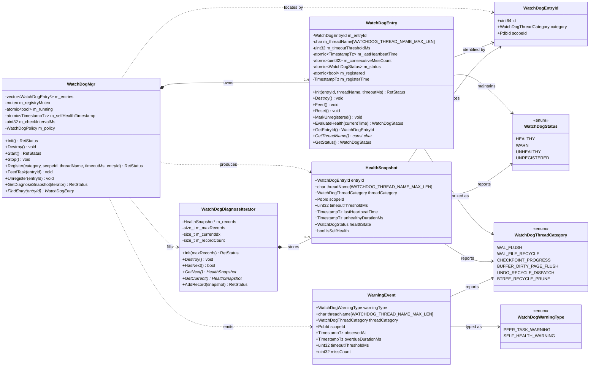
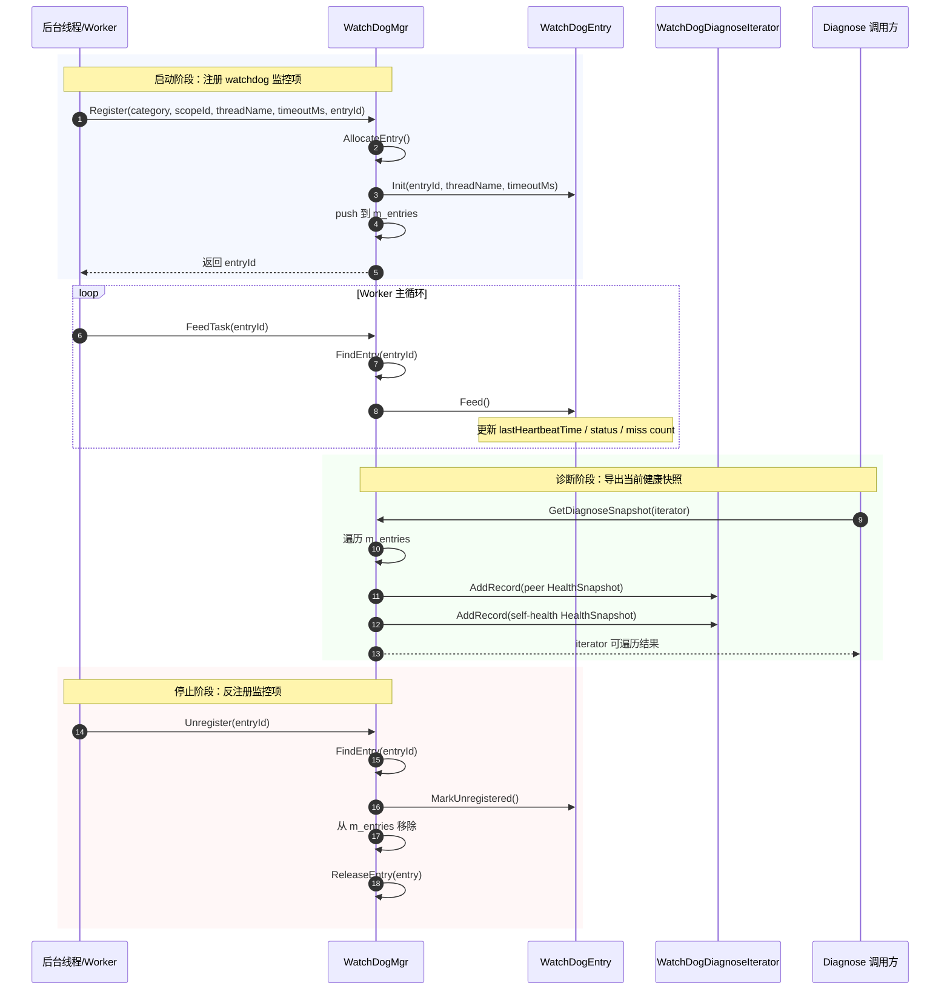

# QA 图片：Watchdog 核心 UML 与运行时交互图

## 1. 目标

这份文档用于内部知识分享活动，聚焦 watchdog 特性当前实现中的核心类型关系，以及 `Register / Feed / Unregister / Diagnose` 运行时交互路径。

## 2. 核心类型依赖图

## 3. 运行时交互图（Register / Feed / Unregister / Diagnose）

## 4. 分享时的解读建议

- 第一张图适合解释“谁拥有谁、谁产出谁”。
- 第二张图适合解释“线程如何接入 watchdog，以及 diagnose 如何得到结果”。
- 如果需要强调当前实现决策，可以重点指出两点：
  1. `WatchDogMgr` 负责 `WatchDogEntry` 的完整生命周期；
  2. diagnose 结果除了 peer entries，还会始终包含 watchdog 自健康记录。

## 5. 讲解提纲（适合 8~12 分钟分享）

### 5.1 开场：先讲“为什么要做 watchdog”

可以先用一句话建立问题背景：

> 我们不是在做一个通用监控平台，而是在 dstore 内部补上一条“后台线程 hang 住时，系统至少能自我感知并暴露状态”的最小闭环。

这一段建议只讲 30~60 秒，重点把听众拉到同一个问题空间：

- 哪些线程值得监控；
- 为什么要用 heartbeat 而不是更重的诊断手段；
- 为什么第一版只做 log-only 与 diagnose，不做自动修复。

### 5.2 第一页图：先讲静态结构，再讲职责边界

建议按下面顺序讲类图：

1. **先讲 `WatchDogMgr`**
   - 它是总控；
   - 管 entry 注册表；
   - 管扫描周期；
   - 管自健康状态；
   - 对外输出 diagnose snapshot。

2. **再讲 `WatchDogEntry`**
   - 它不是线程本体；
   - 它只是一个“被监控线程的运行时元数据对象”；
   - 核心字段是 `entryId`、`lastHeartbeatTime`、`healthState`、`consecutiveMissCount`。

3. **然后讲 `HealthSnapshot` 和 `WarningEvent`**
   - 一个偏“查询面”；
   - 一个偏“告警面”；
   - 它们都是从 manager/entry 当前状态派生出来的结果对象。

4. **最后讲 `WatchDogDiagnoseIterator`**
   - 它不是业务核心状态；
   - 它只是 diagnose 输出的承载与遍历器；
   - 所以它依赖 `HealthSnapshot`，但不拥有监控逻辑。

一句收束建议：

> 这张图最重要的不是字段细节，而是 ownership：`WatchDogMgr` owns `WatchDogEntry`，而 diagnose / warning 是 manager 基于当前状态导出的结果，不反向驱动 manager。

### 5.3 第二页图：重点讲生命周期闭环

讲时不要逐行念 sequence diagram，建议拆成 4 个动作：

1. **Register**：线程启动时把自己纳入监控；
2. **Feed**：线程在主循环里持续刷新 heartbeat；
3. **Unregister**：线程退出时从监控集合里移除；
4. **Diagnose**：外部调用方随时读取当前快照。

这里建议重点强调两个实现决策：

- `Register` 返回的是 `WatchDogEntryId`，不是裸对象指针；
- `WatchDogMgr` 负责 entry 的创建与释放，所以线程侧只需要保存一个轻量 ID。

这一页可以用一句话收束：

> runtime 交互的本质，就是“线程负责上报，manager 负责持有、判断、导出”。

### 5.4 演讲时建议特别强调的 3 个点

#### 点 1：为什么 manager-own entry 很重要

这是这次整改里最值得分享的工程经验。

可以这样讲：

- 如果线程自己 new/delete entry，而 manager 也持有它，就会产生 ownership 模糊；
- 一旦线程退出、异常、重启或 unregister 路径不一致，就容易出现悬挂指针、重复释放、诊断面读到过期对象；
- 所以后来改成 `WatchDogMgr` 完整拥有 `WatchDogEntry` 生命周期。

#### 点 2：为什么 self-health 要单独保留一条 snapshot

可以这样讲：

- peer entry 为空，不代表 watchdog 本身没有状态；
- 如果 diagnose 在“没有 peer entry”时直接返回空集，运维侧很难区分“系统健康但无任务”和“watchdog 根本没工作”；
- 所以现在 diagnose 始终带一条 self-health 记录。

#### 点 3：为什么状态统一成 `warn`

这一点适合讲“实现一致性”的价值：

- 代码、测试、数据模型、contract 如果状态词不一致，会让排查和沟通成本上升；
- `warn` 作为状态，`warning` 作为事件/日志语义，更容易分层理解；
- 这类术语一致性在知识分享里很值得强调，因为它往往不是功能 bug，但会长期影响维护质量。

### 5.5 建议的结尾页话术

结尾不要只说“功能完成了”，更适合这样总结：

> 这次 watchdog 第一版真正交付的，不只是一个扫描线程，而是一套最小可验证的运行时健康闭环：线程接入、manager 持有、状态演进、日志告警、diagnose 导出，以及可落地的 UT 验证路径。

如果还要补一句下一步，可以说：

> 下一步不是盲目扩 scope，而是把白盒测试边界沉淀清楚，再决定是否往 healing、更多监控对象、或更丰富的诊断能力扩展。
